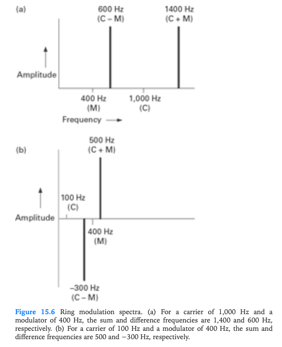
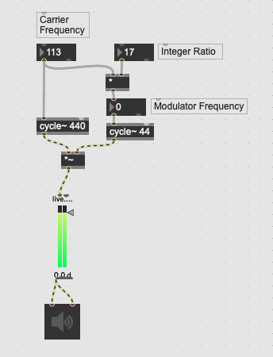
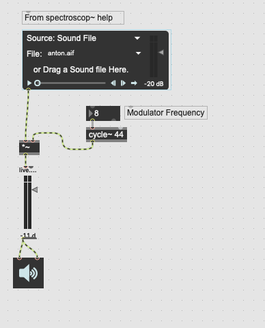
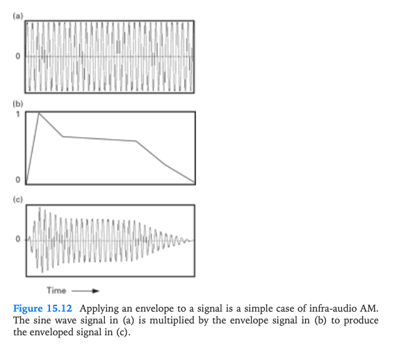
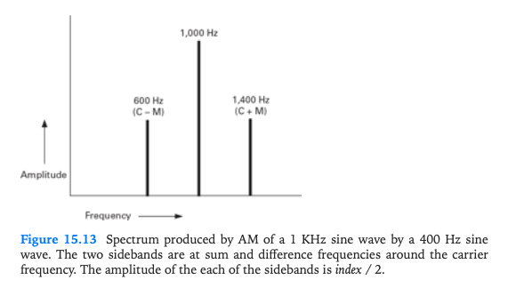
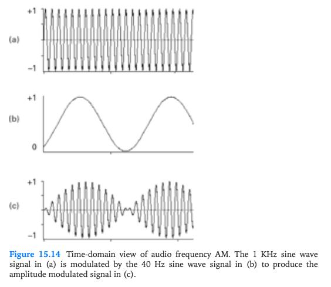
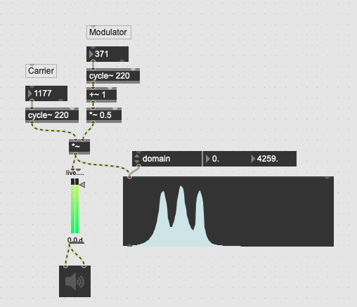
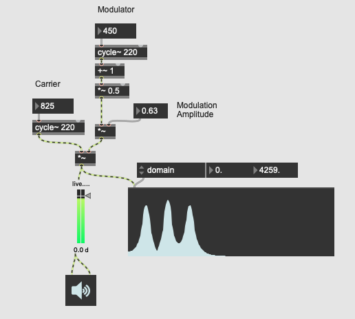

+++
title = "Amplitude and Ring Modulation: Exploring Sidebands, Sum/Difference Tones, and DC Offset"
outputs = ["Reveal"]
+++

# Amplitude and Ring Modulation

**Exploring Sidebands, Sum/Difference Tones, and DC Offset**

---

## Introduction and Overview

- Understand the fundamental principles of amplitude modulation (AM) and ring modulation (RM).
- Identify and describe sidebands and sum/difference tones in the context of AM and RM.
- Implement AM and RM using Max/MSP.
- Identify AM and RM in musical examples. 
- Explain the causes and effects of DC offset in audio signals.

---

## Basic Waveform Review

Photo courtesy of (Roads 2023)

{}
- Remember, the frequency is the number of cycles per second of the waveform, and the amplitude is the waveform height. Each corresponds to pitch and volume.

**Show basic signal generation example in Max. Create cycle, saw, tri, rect, click, and noise. Connect to a selector to switch between waveforms.**

{}

---

## Modulation

Photo courtesy of [moonchild86](https://tenor.com/view/slow-motion-waterdrop-drop-water-gif-24561130)

- [Sound example from Ableton's Learning Synths](https://learningsynths.ableton.com/en/lfos/change-that-repeats)

{}
- Modulation is when one signal changes another signal in some way. In the image, the water droplet is causing ripples in the water (modulating the water). The amplitude of the ripples is due to the force of the water drop. 
- In audio, typically modulation is caused when one oscillator or noise waveform changes the amplitude, frequency, or phase of another waveform.
- This can be done in many ways, such as amplitude modulation (AM), frequency modulation (FM), ring modulation (RM), and phase modulation (PM).
- An example of tremolo can be seen in the Learning Synths link above.
{}

---

## Modulation Definitions

- **Carrier (C)-** the original waveform
- **Modulator (M)-** the waveform that changes the carrier
- **Modulation Index** - the amount of change the modulator has on the carrier

{}
- The carrier is the original waveform that is being changed by the modulator.
- The modulator is the waveform that changes the carrier.
- The modulation index is the amount of change the modulator has on the carrier. For example, in AM, the modulation index is the amplitude of the modulator.
- If the modulator is in the low frequency range, below 20 Hz, we hear a tremolo (slow amplitude variation) or vibrato (slow pitch variation). 
{}

---

## Sidebands Comparison

Photo courtesy of (Roads 2023)

{}
If the modulator is in the audio range, we hear sidebands and sum/difference tones.
{}

---

### Modulation in Lous and Bebe Barron's soundtrack to Forbidden Planet (1956)

<iframe width="560" height="315" src="https://www.youtube.com/embed/0UrG3Fx69Ws?si=3LwpqFb9xhk8Kh8L" title="YouTube video player" frameborder="0" allow="accelerometer; autoplay; clipboard-write; encrypted-media; gyroscope; picture-in-picture; web-share" referrerpolicy="strict-origin-when-cross-origin" allowfullscreen></iframe>

{}
A limitation of all forms of modulation is their unique character. Because modulation formulas are deterministic, they can sound quite dated and old-fashioned, primarily when implemented in a computer rather than an analog system. A successful musical use of modulation techniques is Lous and Bebe Barron's soundtrack to Forbidden Planet (1956).
{}

---

## Bipolar and Unipolar Signals 

Photo courtesy of (Roads 2023)

{}
- RM and AM are two closely related classic modulation effects. Before we compare them, we first need to understand the different types of signals involved: bipolar and unipolar.
- A **bipolar** signal is standard to most audio waveforms. It has negative and positive oscillations around zero and a range between -1 and 1.
- A **unipolar** signal, in contrast, stays within one-half of the full range of the system.
- If we want to convert between unipolar and bipolar, we need to add a constant value and scale the result if necessary to keep from clipping the amplitude.

{}

---

## Direct Current (DC) Offset

Photo courtesy of [Circuits Gallery](https://www.circuitsgallery.com/oscilloscope-dc-offset-calculation-of-dc-bias/)

{}
- **Direct Current (DC) offset**—Another name for this constant is the DC offset. In an analog system, the DC offset might change over time (drift) but does not periodically repeat.
- In analog systems DC offset is seen as something that is unwanted and needs to be removed. 
- We have learned the difference between bipolar and unipolar because they determine the main difference between RM and AM-RM, which uses two bipolar signals, and AM, which uses a bipolar and a unipolar signal.
{}

---

## Intro to AM and RM

  <h3>Ring Modulation</h3>
  <ul>
    <li>Carrier × Modulator</li>
    <li>Output Range: -1 to 1</li>
    <li>Carrier frequency is lost.</li>
  </ul>

  <h3>Amplitude Modulation</h3>
  <ul>
    <li>Carrier × Modulator</li>
    <li>Output Range: 0 to 1</li>
    <li>Carrier frequency is preserved.</li>
  </ul>

{}
- **Ring Modulation (RM)** - Multiplies carrier and modulator signals with output range -1 to 1. The carrier frequency is not preserved in the output signal, producing distinctive metallic tones and inharmonic spectra.
- **Amplitude Modulation (AM)** - Multiplies carrier signal with modulator signal offset to range 0 to 1. The carrier frequency remains present in the output, creating tremolo effects and sidebands while maintaining the original pitch.
- **Key Difference**: RM creates more dramatic timbral changes due to carrier suppression, while AM preserves the carrier for more subtle modulation effects. Both techniques are fundamental to audio synthesis and sound design.

{}

---

## Ring Modulation 

{}
\text{RingMod}(t) = C(t) \times M(t)
{}

{}
- We'll start with RM because it's simpler. 
- Ring Modulation (RM) is a classic and typical sound of early electronic music. While we'll first experiment with multiplying two simple waveforms, sine tones, RM can be very effective when using a sampled sound as the carrier signal, as it can impose subtle frequency changes.
- By slightly changing RM parameters, one could create many variations of percussion sounds, making the sampled sound more realistic.
- In a digital system, the formula for RM is  RingModt = Ct * Mt where t (time)
- If the frequency of the modulator is below 20 Hz, the effect of the RM is a tremolo or a periodic amplitude change. When the frequency of the modulator is above 20 Hz, the impact on the carrier is more of a timbral change.

{}

---

## Sum and Difference Tones

    {}
    \text{SumTone}(t) = C(t) + M(t)
    {}

    {}
    \text{DiffTone}(t) = C(t) - M(t)
    {}

    

{}
- The sum and difference tones are the result of adding or subtracting the carrier and modulator signals.
- The sum tone is the result of adding the carrier and modulator signals, while the difference tone is the result of subtracting the modulator from the carrier.
{}

---

### RM wavforms over a 1s timeframe. 

Photo courtesy of (Roads 2023)

---

## Max Demo: Ring Modulation

{}
graph TD
    A[Carrier: cycle~ 440] --> B[*~]
    B --> C[dac~]
    D[Modulator: cycle~ 100] --> B
{}

{}
- We'll get a tremolo effect if we set the modulating frequency below 20 Hz. We hear the modulation as the volume changes over time because it's within the just-noticeable difference threshold where our brains can distinguish two events.
	- **Critical Band** - The bands because they're within the critical band range of frequencies that determine how the ear perceives sound.
- The slow rate of the modulator also causes the sum and difference tones to fuse.
- We also hear the tremolo rate as twice the modulator rate because the modulator is zero twice per cycle.
- If we increase the modulator rate by multiples of two, we can hear the relationship moving up in half notes, quarter notes, eighth notes, sixteenth notes, etc.
- Moving the modulator rate to the 16th note range borders on the audio rate, above the just-noticeable difference. At this rate, we start to get actual ring modulation.
{}

---

### View with Scope~ and Spectroscope~

---

## Harmonic and Inharmonic Sidebands

{}
- Carrier Suppression
	- We won't hear the carrier frequency because the multiplication suppresses it.
- **Harmonic and Inharmonic**
	- If the carrier and modulator frequencies are in an integer ratio to each other, the sidebands will be harmonically related; otherwise, the sidebands will be inharmonic14. This distinction affects the perceived consonance or dissonance of the output signal1416.
	- Show this in max by C * an integer before running it into the modulator so that the relationship is always an integer. Then adjust the carrier slightly to hear the detune.
		- Remember that you have to adjust the carrier frequency after changing the integer because of left-to-right foolishness.
{}

---

## Try with a sound file

---

## Applications of RM

<iframe width="656" height="315" src="https://www.youtube.com/embed/0sAxyu2jOug" title="Karlheinz Stockhausen: Mixtur (1964)" frameborder="0" allow="accelerometer; autoplay; clipboard-write; encrypted-media; gyroscope; picture-in-picture; web-share" referrerpolicy="strict-origin-when-cross-origin" allowfullscreen></iframe>

<iframe width="664" height="315" src="https://www.youtube.com/embed/mxD-5z_xHBU" title="Dalek - EXTERMINATE!" frameborder="0" allow="accelerometer; autoplay; clipboard-write; encrypted-media; gyroscope; picture-in-picture; web-share" referrerpolicy="strict-origin-when-cross-origin" allowfullscreen></iframe>

{}
Early RM examples often used a recorded carrier signal and a sine wave modulator. The German Composer Karlheinz Stockhausen used RM in a lot of his works. Here's an example where you can hear it at on the flute.
{}

---

## Analog RM

<iframe title="vimeo-player" src="https://player.vimeo.com/video/5301073?h=7c6b362e65" width="640" height="360" frameborder="0"    allowfullscreen></iframe>

---

## Amplitude Modulation

{}
\text{AmplitudeMod}(t) = \frac{1}{2} \times (1 + M(t)) \times C(t)
{}

{}
- AM is a bit more complicated than RM because it involves a unipolar signal.
- The formula for AM is AmplitudeMod(t) = 1/2 * (1 + M(t)) * C(t)
- The 1/2 is there to keep the amplitude from going over 1.
- The 1 + M(t) is there to keep the amplitude from going below 0.
- The carrier frequency is preserved in the output signal, and the modulator changes the amplitude of the carrier.

- Amplitude modulation is one of the oldest modulation techniques in electronic music.
- Similarly to RM, the amplitude of the carrier wave is modulated by the modulator wave. The difference between the techniques is that the carrier in AM is unipolar instead of bipolar
	- **Amplitude Modulation** - involves multiplying a carrier signal with a modulator signal. The modulation range is between 0 and 1. The original carrier signal is preserved.
	- The modulator is typically a unipolar signal, meaning the entire waveform is above zero. The carrier signal is typically bipolar, meaning it varies between -1 and +1
{}

---

## Amplitude Envelope

Photo courtesy of (Roads 2023)

{}
A straightforward example of AM involves the standard amplitude envelope found on all synthesizers. The envelope is unipolar, and the sine wave is bipolar.
{}

---

## Comparing Sidebands

Photo courtesy of (Roads 2023)

{}
Sideband creation works the same, but the AM spectrum contains the carrier frequency as well as the sidebands. Here's a frequency domain figure.
{}

---

## Max Demo: Amplitude Modulation

---

## Adjust Mod Amount

---

## Max Exercise

- Create a patch that lets you switch between RM and AM.
- Also allow for the selection of different waveforms for the carrier and modulator.

---

## Sources

<iframe src="./bib-test.pdf" width="100%" height="500px"></iframe>

