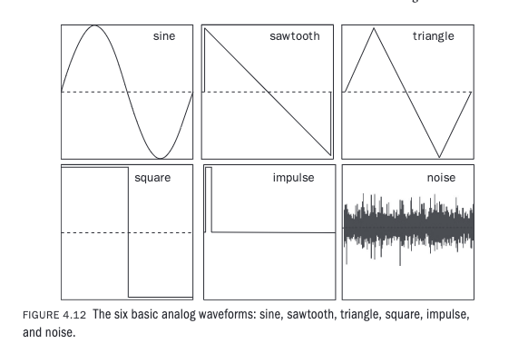
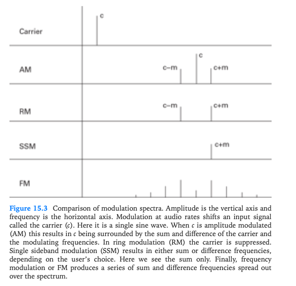
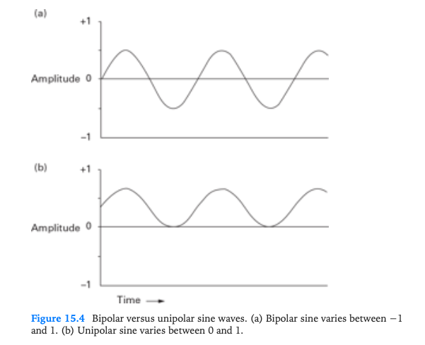
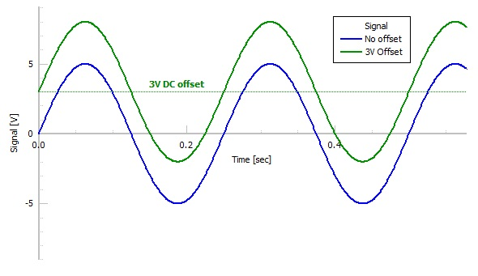

+++
title = "Amplitude and Ring Modulation: Exploring Sidebands, Sum/Difference Tones, and DC Offset"
outputs = ["Reveal"]
+++

# Amplitude and Ring Modulation

**Exploring Sidebands, Sum/Difference Tones, and DC Offset**

---

## Introduction and Overview

- Understand the fundamental principles of amplitude modulation (AM) and ring modulation (RM).
- Identify and describe sidebands and sum/difference tones in the context of AM and RM.
- Implement AM and RM using Max/MSP.
- Identify AM and RM in musical examples. 
- Explain the causes and effects of DC offset in audio signals.

---

## Basic Waveform Review

Photo courtesy of (Roads 2023)

{}
- Remember, the frequency is the number of cycles per second of the waveform, and the amplitude is the waveform height. Each corresponds to pitch and volume.

**Show basic signal generation example in Max. Create cycle, saw, tri, rect, click, and noise. Connect to a selector to switch between waveforms.**

{}

---

## Modulation

Photo courtesy of [moonchild86](https://tenor.com/view/slow-motion-waterdrop-drop-water-gif-24561130)

- [Sound example from Ableton's Learning Synths](https://learningsynths.ableton.com/en/lfos/change-that-repeats)

{}
- Modulation is when one signal changes another signal in some way. In the image, the water droplet is causing ripples in the water (modulating the water). The amplitude of the ripples is due to the force of the water drop. 
- In audio, typically modulation is caused when one oscillator or noise waveform changes the amplitude, frequency, or phase of another waveform.
- This can be done in many ways, such as amplitude modulation (AM), frequency modulation (FM), ring modulation (RM), and phase modulation (PM).
- An example of tremolo can be seen in the Learning Synths link above.
{}

---

## Modulation Definitions

- **Carrier (C)-** the original waveform
- **Modulator (M)-** the waveform that changes the carrier
- **Modulation Index** - the amount of change the modulator has on the carrier

{}
- The carrier is the original waveform that is being changed by the modulator.
- The modulator is the waveform that changes the carrier.
- The modulation index is the amount of change the modulator has on the carrier. For example, in AM, the modulation index is the amplitude of the modulator.
- If the modulator is in the low frequency range, below 20 Hz, we hear a tremolo (slow amplitude variation) or vibrato (slow pitch variation). 
{}

---

## Sidebands Comparison

Photo courtesy of (Roads 2023)

{}
If the modulator is in the audio range, we hear sidebands and sum/difference tones.
{}

---

### Modulation in Lous and Bebe Barron's soundtrack to Forbidden Planet (1956)

<iframe width="560" height="315" src="https://www.youtube.com/embed/0UrG3Fx69Ws?si=3LwpqFb9xhk8Kh8L" title="YouTube video player" frameborder="0" allow="accelerometer; autoplay; clipboard-write; encrypted-media; gyroscope; picture-in-picture; web-share" referrerpolicy="strict-origin-when-cross-origin" allowfullscreen></iframe>

{}
A limitation of all forms of modulation is their unique character. Because modulation formulas are deterministic, they can sound quite dated and old-fashioned, primarily when implemented in a computer rather than an analog system. A successful musical use of modulation techniques is Lous and Bebe Barron's soundtrack to Forbidden Planet (1956).
{}

---

## Bipolar and Unipolar Signals 

Photo courtesy of (Roads 2023)

{}
- RM and AM are two closely related classic modulation effects. Before we compare them, we first need to understand the different types of signals involved: bipolar and unipolar.
- A **bipolar** signal is standard to most audio waveforms. It has negative and positive oscillations around zero and a range between -1 and 1.
- A **unipolar** signal, in contrast, stays within one-half of the full range of the system.
- If we want to convert between unipolar and bipolar, we need to add a constant value and scale the result if necessary to keep from clipping the amplitude.

{}

---

## Direct Current (DC) Offset

Photo courtesy of [Circuits Gallery](https://www.circuitsgallery.com/oscilloscope-dc-offset-calculation-of-dc-bias/)

{}
- **Direct Current (DC) offset**—Another name for this constant is the DC offset. In an analog system, the DC offset might change over time (drift) but does not periodically repeat.
- In analog systems DC offset is seen as something that is unwanted and needs to be removed. 
- We have learned the difference between bipolar and unipolar because they determine the main difference between RM and AM-RM, which uses two bipolar signals, and AM, which uses a bipolar and a unipolar signal.
{}

---

## Intro to AM and RM

  <h3>Ring Modulation</h3>
  <ul>
    <li>Carrier × Modulator</li>
    <li>Output Range: -1 to 1</li>
    <li>Carrier frequency is lost.</li>
  </ul>

  <h3>Amplitude Modulation</h3>
  <ul>
    <li>Carrier × Modulator</li>
    <li>Output Range: 0 to 1</li>
    <li>Carrier frequency is preserved.</li>
  </ul>

{}
- **Ring Modulation (RM)** - Multiplies carrier and modulator signals with output range -1 to 1. The carrier frequency is not preserved in the output signal, producing distinctive metallic tones and inharmonic spectra.
- **Amplitude Modulation (AM)** - Multiplies carrier signal with modulator signal offset to range 0 to 1. The carrier frequency remains present in the output, creating tremolo effects and sidebands while maintaining the original pitch.
- **Key Difference**: RM creates more dramatic timbral changes due to carrier suppression, while AM preserves the carrier for more subtle modulation effects. Both techniques are fundamental to audio synthesis and sound design.

{}

---

## Ring Modulation 

---

## Sources

<iframe src="./bib-test.pdf" width="100%" height="500px"></iframe>

